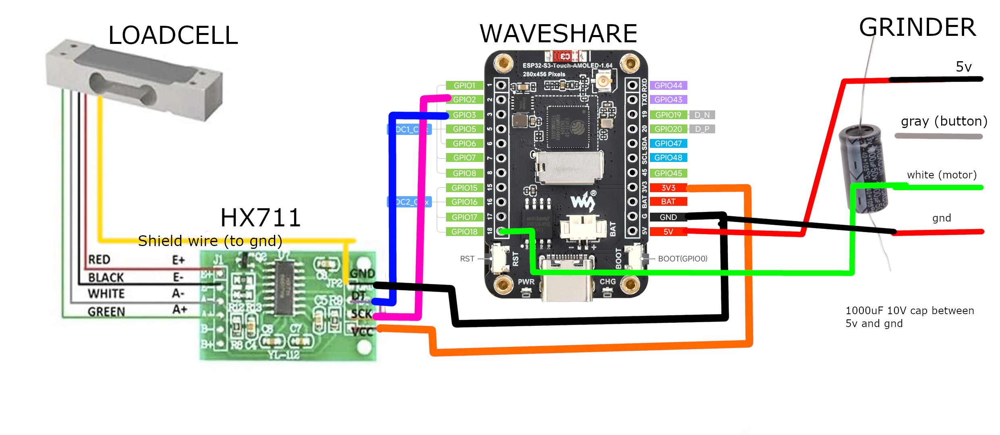

# Smart Grind-by-Weight Documentation

Complete build instructions, parts list, and usage guide for the Smart Grind-by-Weight system.

---

## 📋 Table of Contents

- [Parts List](#️-parts-list)
- [Assembly Video](#-assembly-video)
- [Installation & Wiring](#-installation--wiring)
- [Build Instructions](#-build-instructions)
- [Initial Calibration](#️-initial-calibration)
- [Usage Guide](#-usage-guide)
- [User Interface Navigation](#️-user-interface-navigation)
- [Bluetooth Connectivity](#-bluetooth-connectivity)
- [Analytics & Data Export](#-analytics--data-export)
- [Algorithm Details](#-algorithm-details)
- [Frequently Asked Questions](#-frequently-asked-questions)
- [Troubleshooting](#-troubleshooting)

---

## 🛠️ Parts List

### Electronics
- **[Waveshare ESP32-S3 1.64inch AMOLED Touch Display](https://www.waveshare.com/esp32-s3-touch-amoled-1.64.htm)** - Main controller
- **HX711 ADC module** - Load cell amplifier  
- **MAVIN or T70 load cell** (0.3 - 1KG range) - Don't use cheap unshielded small load cells, you'll hurt the accuracy
  - **0.3kg**: Suitable for dosing cups only
  - **1kg**: Recommended if adapting for portafilter holder use
  - Examples: 
    - [AliExpress T70](https://nl.aliexpress.com/item/1005009409460619.html)
    - [TinyTronics MAVIN](https://www.tinytronics.nl/en/sensors/weight-pressure-force/load-cells/mavin-load-cell-0.3kg)
    - [Mavin 0.3 or 1kg](https://www.alibaba.com/product-detail/subject_1601564701384.html)
    - [T70 1kg](https://nl.aliexpress.com/item/1005008658337192.html)
- **6× M3 screws** (±10mm long)
- **1000μF capacitor** (10V) - Power filtering
- **Wires and dupont connectors**
- **Angled pin headers** (not the straight kind)
- **JST-PH 4 pin male connector** (optional - if you don't want to solder to Eureka)

[](media/waveshare_board_wired_up_1.jpg)

### 3D Printed Parts

All parts designed to print **without supports**. Keep the orientation of the STL files. Some holes are covered with thin plastic layers that you can easily remove.

**Print Settings:**
- **Material**: PETG (preferred) - Flexible enough for snap fits to work properly
- **Layer Height**: 0.2mm
- **Alternative**: PLA might work but will offer a reduced experience due to brittleness

> **📅 Update 21-09-2025:** Important fit tweak for T70 load cell users. Updated Cup holder.stl and Back plate.stl to accommodate T70 load cells. All users with T70 load cells must use the latest 3D files for proper fit.

- **[Screen adapter](3d_files/Waveshare%20AMOLED%201_64%20adapter.stl)** - Mounts Waveshare screen to Eureka location
- **[Back plate](3d_files/Back%20plate.stl)** - Mounts to Eureka and holds HX711/load cell  
- **[Cover plate](3d_files/Cover.stl)** - Clean finishing cover
- **[Dosing cup holder](3d_files/Cup%20holder.stl)** - Connects to load cell for dosing cup
- **[Screw hole covers](3d_files/Cup%20holder%20hole%20cover.stl)** - Hides screws and protects against coffee grounds

### Fusion 360 Source Files
- **[All components](https://a360.co/3HYgubb)** - Customizable source files

Use these to adjust mounts for your specific grinder. Tuned for 54mm dosing cups. 
Compatible dosing cup: [AliExpress 54mm Cup](https://nl.aliexpress.com/item/1005006526852408.html)

---

## 📹 Assembly Video

Watch the complete Eureka Mignon Specialita assembly process: **[YouTube Assembly Guide](https://youtu.be/-kfKjiwJsGM)**

---

## 🔌 Installation & Wiring

[](media/wiring_diagram.png)

### Pin Configuration

**HX711 Load Cell Amplifier Connections:**
```
ESP32-S3 GPIO 2    →    HX711 SCK
ESP32-S3 GPIO 3    →    HX711 DOUT
ESP32-S3 3.3V      →    HX711 VCC
ESP32-S3 GND       →    HX711 GND
```

**Eureka Mignon Connections:**

⚠️ **CRITICAL WARNING:** Always verify your specific Eureka's wiring independently! Wire colors vary between units and cannot be trusted. Use the numbered pin positions shown in the reference image.

Using the 4-pin Eureka plug pinout (see `media/4-pin_Eureka_plug_pinout.png`), counting from left to right with the plug oriented with 'ribs' towards you:

[](media/4-pin_Eureka_plug_pinout.png)

```
ESP32-S3 5V        →    Pin 1 (5V power)
                        Pin 2 (Button signal - not used in this project)
ESP32-S3 GPIO 18   →    Pin 3 (Motor control signal)
ESP32-S3 GND       →    Pin 4 (Ground)
```

**4-Pin Eureka Plug Reference (Left to Right):**
- **Pin 1**: 5V power supply
- **Pin 2**: Button signal (unused in this project)  
- **Pin 3**: Motor control signal
- **Pin 4**: Ground

⚠️ **VERIFY 5V:** Use a multimeter to confirm 5V pin - wire colors vary between units! The Waveshare board has reverse polarity protection, and button/motor wires can be swapped without risk of damage.

### Installation Steps

1. **Flash the firmware** on the Waveshare board (see Build Instructions below)
2. **Add the 1000μF capacitor** between 5V and ground (protects against brownouts)
3. **Create HX711 to Waveshare connection:**
   - Add angled pin headers to HX711 (VCC, GND, DOUT, SCK pins)
   - Connect dupont cables to Waveshare board
   - Load cell can be directly soldered to HX711
4. **For Eureka Mignon assembly:**
   - Disassemble top plate and front plate
   - Remove the button and store it (not needed)
   - Use JST-PH plug to connect to Waveshare board
   - **WARNING:** Wire colors vary significantly between Eureka units - always verify pin functions with a multimeter before connecting!
   - Mount Waveshare screen using 3D printed adapter where original screen was
   - Fish HX711 wire through housing, exit via button hole
   - Mount load cell and HX711 to 3D printed back plate
   - Clip 3D printed back plate onto Eureka Mignon
   - Connect plug to HX711
   - Add 3D printed cover plate and screw down
   - Add 3D printed dosing cup holder on load cell and screw down
   - Hide screws with 3D printed screw covers

---

## 🚀 Build Instructions

### Development Platform

This project uses the **pioarduino ESP32 platform** (a community fork) instead of the standard Espressif ESP32 platform. This ensures proper support for our device.

**Platform Details:**
- **Platform**: [pioarduino/platform-espressif32](https://github.com/pioarduino/platform-espressif32) (stable release)
- **Framework**: Arduino ESP32 Core 3.x (controlled by pioarduino platform)
- **Target**: ESP32-S3 with AMOLED touch display

The platform dependency is automatically handled by PlatformIO via the `platformio.ini` configuration.

### Initial USB Flashing
```bash
# Install Python dependencies (auto-handled by grinder tool)
python3 tools/grinder.py install

# Build and upload via USB
python3 tools/grinder.py build
pio run --target upload -e waveshare-esp32s3-touch-amoled-164
```

### BLE OTA Updates (After Initial Setup)
```bash
# Build firmware and upload wirelessly
python3 tools/grinder.py build-upload

# Or upload specific firmware
python3 tools/grinder.py upload path/to/firmware.bin

# Force full firmware update (skip delta patching)
python3 tools/grinder.py build-upload --force-full
```

---

## ⚖️ Initial Calibration

After flashing firmware, calibrate the load cell for accurate measurements:

1. **Access calibration**: Settings → Swipe left to Tools tab → Press "CALIBRATE"
2. **Empty calibration**: Remove all weight from scale platform → Press OK
3. **Weight calibration**: 
   - Place known weight on scale (e.g., coffee mug with water)
   - Use +/- buttons to adjust displayed value to match actual weight
   - Press OK to complete

**Tip**: A coffee mug with water makes ideal calibration weight - weigh it on kitchen scale first.

---

## 📱 Usage Guide

### Grinding Profiles
All profiles are fully customizable - these are default starting weights:
- **Single**: Default ~9g (customizable)
- **Double**: Default ~18g (customizable)  
- **Custom**: Default ~21.5g (customizable)

### Navigation
- **Swipe left/right** to navigate between menu tabs
- **Tap** to select profiles or buttons
- **Long press** on profile weights to edit/customize them

### Basic Operation
1. Select profile by tapping on main screen
2. **Long press** any profile weight to edit/customize it
3. Place dosing cup on scale platform
4. Press GRIND button - scale will tare automatically
5. System grinds to precise target weight using predictive algorithm
6. GRIND COMPLETE screen shows final weight and statistics

### Display Modes
- **Arc Layout**: Clean, minimal arc-based interface
- **Nerdy Layout**: Detailed charts showing flow rates and real-time grinding analytics
- **Switching**: Tap anywhere on grind screen to switch between layouts during grinding

---

## 🗺️ User Interface Navigation

```
Main Screen (swipe left/right between tabs)
|
+-- Single Profile 
|   |-- Weight display (long press to edit)
|   \-- GRIND button
|
+-- Double Profile
|   |-- Weight display (long press to edit)
|   \-- GRIND button
|
+-- Custom Profile
|   |-- Weight display (long press to edit)
|   \-- GRIND button
|
\-- Settings (swipe left/right between sub-tabs)
    |
    +-- Tools
    |   |-- Calibrate button
    |   |-- Motor test button
    |   \-- Tare button
    |
    +-- Info (default tab)
    |   |-- System information
    |   |-- Build version & uptime
    |   |-- Memory & statistics
    |   \-- Refresh stats button
    |
    +-- Settings
    |   |-- Bluetooth toggle (30m timer)
    |   |-- Bluetooth startup toggle (configurable auto-enable)
    |   |-- Brightness sliders
    |   |-- Purge data button (clears logged grind sessions)
    |   \-- Reset settings button
    |
    \-- Reset
        \-- Factory reset options

During Grinding:
|-- Weight display & progress
|-- Tap anywhere: Arc ↔ Nerdy display modes
\-- STOP button
```

---

## 🔵 Bluetooth Connectivity

### Startup Behavior
- **Bluetooth startup is configurable** in **Settings → Settings tab → Startup**
- When enabled: **Bluetooth automatically enables for 5 minutes** after power on
- When disabled: Bluetooth remains off at startup (can still be enabled manually)
- Indicated by blue Bluetooth symbol in top-right corner

### Manual Control
- Enable Bluetooth manually in **Settings → Settings tab**
- **30-minute timer** when manually enabled
- Toggle on/off as needed

### Uses
- **BLE OTA firmware updates** - Wireless firmware flashing
- **Data export** - Transfer grind session data to computer
- **Analytics** - Real-time data streaming for analysis
- **Device management** - Remote configuration and monitoring

---

## 📊 Analytics & Data Export

### Launch Interactive Dashboard
```bash
# Export data and launch Streamlit dashboard
python3 tools/grinder.py analyze

# Or view reports from existing data
python3 tools/grinder.py report
```

### Available Tools
```bash
python3 tools/grinder.py --help          # Show all available commands
python3 tools/grinder.py scan            # Scan for BLE devices
python3 tools/grinder.py connect         # Connect to grinder device  
python3 tools/grinder.py debug           # Stream live debug logs
python3 tools/grinder.py info            # Get device system information
python3 tools/grinder.py export          # Export grind data to database
```

### Tools Directory Structure
- **`grinder.py`**: Cross-platform Python tool for all operations (build, upload, analyze)
- **`ble/`**: BLE communication tools and OTA update system
- **`streamlit-reports/`**: Interactive data visualization and analytics
- **`database/`**: SQLite database management for grind session storage

---

## 🧠 Algorithm Details

### Why This Algorithm Works

- **Zero-shot learning algorithm**: Needs no prior knowledge or manually tuned variables. Instantly adapts to changes in temperature, humidity, grinding coarseness, bean type, etc.
- **Two-tier approach**: Grinding is noisy (mechanical, electrical) so we use a sophisticated approach:
  - **Predictive Phase**: Grind as fast as possible using predictive algorithm to barely UNDERSHOOT target weight (overshoot is unrecoverable)
  - **Learning Phase**: Learns flow rate and grind latency (bean to cup time) to predict when to stop motor (coast time)
  - **Pulse Phase**: Uses worst-case (95th percentile) flow rate for conservative pulsing until target ± tolerance is reached

### Key Algorithm Steps

1. **Determine grind latency** from first detectable flow over 500ms confirmation window
2. **Compute motor stop target weight** from latency × flow × coast ratio (USER_LATENCY_TO_COAST_RATIO)
3. **Stop at target - motor_stop_target_weight**, then apply bounded pulses based on 95th percentile flow rate
4. **Conservative approach**: Err on undershooting to prevent overshoot, repeat until target ± tolerance reached

---

## ❓ Frequently Asked Questions

**Will this modification work on grinders other than the Eureka Mignon Specialita (e.g., Baratza, Niche, or other Eureka models like the Crono, Atom, XL, Manuale)?**

The electronics are universal, but you'll need to explore your specific grinder. Find a 5V supply internally or provide one externally (USB adapter). Identify motor control signals and design custom mounting for the display and scale. I can't provide specific guidance for other grinders as I don't have access to test them. The Fusion 360 source files are included to help with adaptations.

**Can I use this to grind directly into a portafilter instead of a dosing cup?**

Yes, but you'll need to make modifications. Use a 1kg load cell instead of 0.3kg for better accuracy with heavier portafilters. You'll also need to design and 3D print a custom portafilter holder that mounts to the load cell. The dosing cup holder design can serve as a starting point for your portafilter adapter.

**What is the benefit of this mod for a single-dosing grinder like the Niche Zero?**

It's about workflow optimization vs. ultimate precision. Benefits: easier workflow with no manual measuring, precise dose accounting for retention, consistent results. Downside: potential stale retention from previous grinds. Choose based on your goals - do you want optimized ease and consistency, or are you willing to accept daily complexity for that perfect shot? This mod strikes a balance toward maintainable workflow efficiency.

---

## 🔧 Troubleshooting

For common build and setup issues, see **[TROUBLESHOOTING.md](TROUBLESHOOTING.md)** which covers:

- Unknown board ID errors in PlatformIO
- Project initialization issues with pioarduino platform
- Platform package cache problems
- Clean build procedures

---

For additional support, refer to the project repository issues section, but please note that support availability is limited as mentioned in the project status.