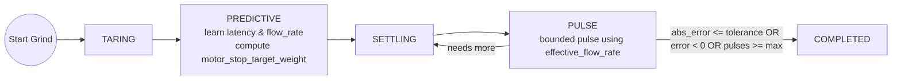
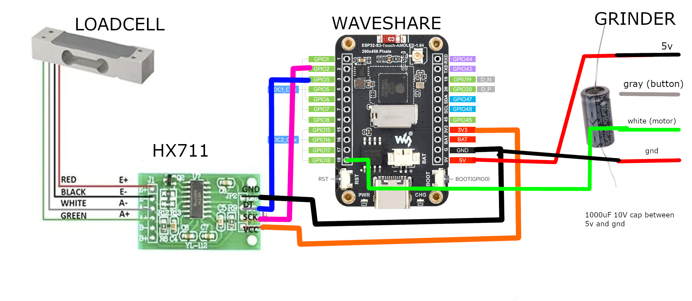

# Smart Grind-by-Weight

**Turn any grinder into a precision smart grind-by-weight system**

[](images/smart-grind-by-weight-render.PNG)

The Smart Grind-by-Weight is a user-friendly, touch interface-driven, highly accurate open source grinder modification that transforms any grinder with a motor relay accepting 3.3V logic levels into an intelligent grind-by-weight system. Originally developed for the Eureka Mignon Specialita, the system can be easily adapted for other grinders.

**The concept is simple:** Perform a "brain swap" on your grinder. Replace the original controller with our intelligent ESP32-S3 controller and add a precision load cell to the mix.

**Upgrade cost:** €30-40 in parts

**Target accuracy:** ±0.05g tolerance

Currently the 3D printed scale components are designed for a 54mm dosing cup. You can adjust them to your specific needs using the included Fusion 360 source files.

---

## ✨ Features

- **User-friendly interface** with 3 profiles: Single, Double, Custom
- **Beautiful display** with simple graphics or detailed charts (easily switchable between the two)
- **High accuracy**: ±0.05g error tolerance
- **For the Eureka**: No permanent modifications needed. Just swap the screen and add 3D printed parts.
- **BLE OTA updates** for firmware
- **Advanced analytics and data logging** using BLE data transfer and a local Python Streamlit report

---

## 🧠 Grinding Algorithm

Our predictive grinding system uses an intelligent approach that learns and adapts:



Key ideas:
- Determine grind latency from first detectable flow over a 500ms confirmation window.
- Compute a motor stop target weight from latency x flow x coast ratio (USER_LATENCY_TO_COAST_RATIO).
- Stop at target - motor_stop_target_weight, then apply bounded pulses based on 95th percentile flow rate.

### Why This Algorithm

- **Zero-shot learning algorithm**: An algorithm that needs no prior knowledge or manually tuned variables. Instantly adapts to changes in temperature, humidity, grinding coarseness, bean type, etc.
- **Two-tier approach**: Grinding is very noisy (mechanical, electrical) so we use a sophisticated approach:
  - First try to grind as fast as possible using a predictive algorithm where we try to just barely UNDERSHOOT the target weight (because overshoot is unrecoverable)
  - This learns us about the flow rate and grind latency (bean to cup time), which is used to predict when to stop the motor (coast time)
  - Then we use the worst (highest) 95th percentile flow rate to start pulsing until the cup is full. We're conservative because the real world is less predictable than we want. We err on undershooting to prevent overshoot. We repeat until the target ± tolerance is reached.

---

## 🛠️ Parts List

**Electronics:**
- Waveshare ESP32-S3 1.64inch AMOLED Touch Display - https://www.waveshare.com/esp32-s3-touch-amoled-1.64.htm
- HX711 ADC module  
- MAVIN or T70 load cell (0.3 - 1KG range) - Don't use cheap unshielded small load cells, you'll hurt the accuracy
  - Examples: https://nl.aliexpress.com/item/1005009409460619.html
  - https://www.tinytronics.nl/en/sensors/weight-pressure-force/load-cells/mavin-load-cell-0.3kg
- 6× M3 screws (±10mm long)
- 1000μF capacitor (10V)
- Wires and dupont connectors
- Angled pin headers (not the straight kind)
- If you don't want to solder to the Eureka: a JST-PH 4 pin male connector (buy a JST-PH kit)

**3D Printed Parts:**

All parts have been designed to print without support. Keep the orientation of the STL files. To make it printable without supports, some holes are covered with a thin layer of plastic that you can easily remove.

- **[Screen adapter](3d_files/Waveshare%20AMOLED%201_64%20adapter.stl)** - Holds the Waveshare screen at the location of the original Eureka Mignon screen
- **[Back plate](3d_files/Back%20plate.stl)** - Mounts to the Eureka Mignon and holds the HX711 and load cell  
- **[Cover plate](3d_files/Cover.stl)** - To make it look clean :)
- **[Dosing cup holder](3d_files/Cup%20holder.stl)** - Connects to the other end of the load cell and offers a place for the dosing cup
- **[Dosing cup holder screw hole covers](3d_files/Cup%20holder%20hole%20cover.stl)** - Hides screw holes and protects against coffee grounds

**Fusion 360 Source Files:**
- **All components**: https://a360.co/3HYgubb

Use these to adjust the mounts to your specific use case. They've been tuned to hold a dosing cup snugly. Compatible dosing cup: https://nl.aliexpress.com/item/1005006526852408.html

---

## 📹 Assembly Video

Watch the complete Eureka Mignon Specialita assembly process: https://youtu.be/-kfKjiwJsGM

---

## 🔌 Installation

[](images/wiring_diagram.png)

**Pin Configuration:**

**HX711 Load Cell Amplifier Connections:**
```
ESP32-S3 GPIO 2    →    HX711 SCK
ESP32-S3 GPIO 3    →    HX711 DOUT
ESP32-S3 3.3V      →    HX711 VCC
ESP32-S3 GND       →    HX711 GND
```

**Eureka Mignon Connections:**
```
ESP32-S3 GPIO 18   →    WHITE wire (Motor control signal)
ESP32-S3 GND       →    RED wire (⚠️ Ground - non-standard color!)
ESP32-S3 5V        →    BLACK wire (⚠️ Power - non-standard color!)
                        GRAY wire (Button signal - not used)
```

**Eureka 4-Pin Connector Reference:**
- RED wire = GND (⚠️ non-standard!)
- WHITE wire = Motor control signal  
- GRAY wire = Button signal (unused in this project)
- BLACK wire = 5V power (⚠️ non-standard!)

⚠️ **CRITICAL:** Eureka uses reversed wire colors - RED is ground, BLACK is power!

**Installation Steps:**
1. Flash the firmware on the Waveshare board (see Build Instructions below)
2. Add the 1000μF capacitor between 5V and ground (to protect against brownouts)
3. Create a plug connection for the HX711 to Waveshare board:
   - Add angled pin headers to the HX711 (VCC, GND, DOUT, SCK pins)
   - Connect dupont cables to the Waveshare board
   - Load cell can be directly soldered to the HX711
4. **For Eureka Mignon:**
   - Disassemble top plate and front plate. Remove the button and store it (we don't need this button anymore)
   - Use the JST-PH plug to connect to the waveshare board
   - **WARNING:** In some Eureka units, the wire colors to the screen are REVERSED! Test to be sure.
   - Mount the Waveshare screen using the 3D printed adapter plate where the original screen was
   - Fish the HX711 wire through the housing and have it exit via the hole where the button previously was
   - Mount the load cell and HX711 to the 3D printed back plate
   - Clip the 3D printed back plate onto the Eureka Mignon
   - Connect the plug to the HX711
   - Add the 3D printed cover plate and screw down
   - Add the 3D printed dosing cup holder on the load cell and screw down
   - Hide the screws with the 3D printed screw covers

---

## 🚀 Build Instructions

**USB Flashing (Initial Setup):**
```bash
# Install Python dependencies
python3 -m venv tools/venv
tools/venv/bin/pip install -r tools/requirements.txt

# Build and upload via USB  
./tools/grinder build
pio run --target upload -e waveshare-esp32s3-touch-amoled-164
```

**BLE OTA Updates (After Initial Setup):**
```bash
# Build firmware and upload wirelessly  
./tools/grinder build-upload

# Or upload specific firmware
./tools/grinder upload path/to/firmware.bin

# Force full firmware update (skip delta patching)
./tools/grinder build-upload --force-full
```

---

## ⚖️ Initial Calibration

After flashing the firmware to your device, you'll need to calibrate the load cell for accurate weight measurements:

1. **Access calibration**: Open Settings → Swipe left to Tools tab → Press "CALIBRATE"
2. **Empty calibration**: Remove all weight from the scale platform → Press OK
3. **Weight calibration**: 
   - Place a known weight on the scale platform (e.g., coffee mug with water - weigh it first on a kitchen scale)
   - Use the +/- buttons to adjust the displayed weight value to match your known weight
   - Press OK to complete calibration

**Tip**: A coffee mug with some water makes an ideal calibration weight - just weigh it on a kitchen scale first to know the exact weight.

---

## 📱 Usage

**Grinding Profiles:**
All profiles are fully customizable - these are just the default names and starting weights:
- **Single**: Default ~18g (customizable)
- **Double**: Default ~36g (customizable)  
- **Custom**: Default user-defined (customizable)

**Navigation:**
- **Swipe left/right** to navigate between menu tabs
- **Tap** to select profiles or buttons
- **Long press** on profile weights to edit/customize them

**Basic Operation:**
1. Select profile by tapping on main screen
2. **Long press** on any profile weight to edit/customize it
3. Place dosing cup on scale platform
4. Press GRIND button - scale will tare automatically
5. System grinds to precise target weight using predictive algorithm
6. GRIND COMPLETE screen shows final weight and statistics

**Display Modes:**
- **Arc Layout**: Clean, minimal arc-based interface
- **Nerdy Layout**: Detailed charts showing flow rates and real-time grinding analytics
- **Switching**: Tap anywhere on the grind screen to switch between arc and nerdy layouts during grinding

**Bluetooth Connectivity:**
- **Auto-enabled**: Bluetooth automatically enables for 5 minutes after power on (indicated by blue 📶 symbol in top-right corner)
- **Manual control**: Enable Bluetooth manually in Settings → Settings tab (30-minute timer)
- **Uses**: BLE OTA firmware updates, data export, analytics, and device management

---

## 🗺️ User Interface Navigation

```
Main Screen (swipe left/right between tabs)
|
+-- Single Profile 
|   |-- Weight display (long press to edit)
|   \-- GRIND button
|
+-- Double Profile
|   |-- Weight display (long press to edit)
|   \-- GRIND button
|
+-- Custom Profile
|   |-- Weight display (long press to edit)
|   \-- GRIND button
|
\-- Settings (swipe left/right between sub-tabs)
    |
    +-- Tools
    |   |-- Calibrate button
    |   |-- Motor test button
    |   \-- Tare button
    |
    +-- Info (default tab)
    |   |-- System information
    |   |-- Build version & uptime
    |   |-- Memory & statistics
    |   \-- Refresh stats button
    |
    +-- Settings
    |   |-- Bluetooth toggle (30m timer)
    |   |-- Brightness sliders
    |   |-- Purge data button (clears logged grind sessions)
    |   \-- Reset settings button
    |
    \-- Reset
        \-- Factory reset options

During Grinding:
|-- Weight display & progress
|-- Tap anywhere: Arc ↔ Nerdy display modes
\-- STOP button
```

---

## 📊 Streamlit Report & Analytics

[](images/analytics.png)

**Launch Interactive Data Analysis:**
```bash
# Export data and launch Streamlit dashboard
./tools/grinder analyze

# Or view reports from existing data  
./tools/grinder report
```

**Tools Folder Commands:**
```bash
./tools/grinder --help          # Show all available commands
./tools/grinder scan            # Scan for BLE devices
./tools/grinder connect         # Connect to grinder device  
./tools/grinder debug           # Stream live debug logs
./tools/grinder info            # Get device system information
./tools/grinder export          # Export grind data to database
```

The `tools/` directory contains:
- **`grinder`**: Unified script for all operations (build, upload, analyze)
- **`ble/`**: BLE communication tools and OTA update system
- **`streamlit-reports/`**: Interactive data visualization and analytics
- **`database/`**: SQLite database management for grind session storage

---

## 🙏 Credits & Inspiration

This project was inspired by and builds upon the excellent work of:

- **[openGBW](https://github.com/jb-xyz/openGBW)** by jb-xyz - Open source grind-by-weight system
- **[Coffee Grinder Smart Scale](https://besson.co/projects/coffee-grinder-smart-scale)** by Besson - Smart scale integration concepts

---

## 📝 Personal Note

My goal with this project was to get real-life experience coding with AI agents. The code reflects that learning journey. I've learned a lot, but ultimately I'm in awe of how fast you can produce results with AI assistance. 

What I've learned so far is that "vibe coding" with AI is great for POCs and testing theories. But afterward you must pivot and reimplement features while keeping a close eye on the architecture the AI produces. Otherwise you'll get stuck at dead ends that require painful refactoring (been there, done that). 

In this project, that's most obvious when looking at the UI and state management - it's a bit cluttered in places. But I'm very happy with the end result and I'm releasing the project as is. It'll never be perfect, but it works great and transforms the coffee grinding experience.

**Project Status**: This project is shared 'as-is' and I have limited availability for support as I've already invested significant time in its development. While I'm happy to share what I've built, please understand that troubleshooting and feature requests may receive limited attention.

