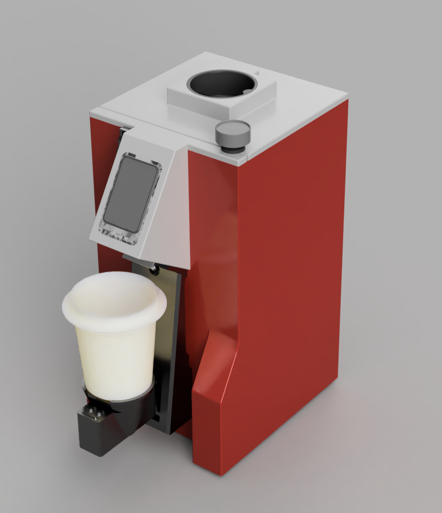
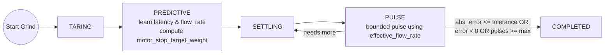
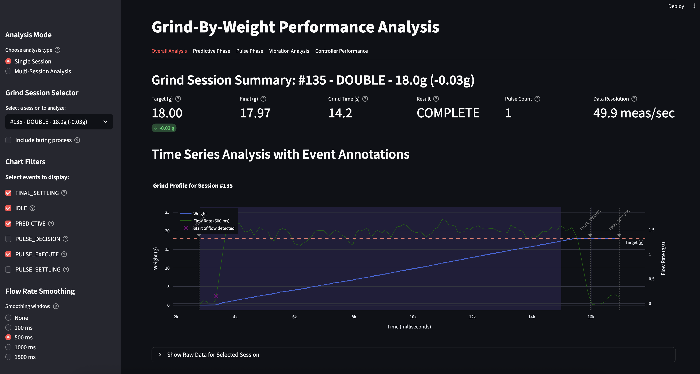

# Smart Grind-by-Weight

**Turn any grinder into a precision smart grind-by-weight system**

<table>
<tr>
<td width="50%">

<video width="100%" controls muted>
  <source src="https://github.com/jaapp/smart-grind-by-weight/raw/main/media/demo_small.mp4" type="video/mp4">
</video>

</td>
<td width="50%">

[](media/smart-grind-by-weight-render.PNG)

</td>
</tr>
</table>

> **⚠️ Newly Released Mod - Buyer Beware!**  
> This is a **recently released modification project** that transforms grinders into smart grind-by-weight systems. While functional and free/open source, it's an **experimental mod** that requires technical skill to build and may have rough edges. **Build at your own risk** - this is not a polished commercial product!

The Smart Grind-by-Weight is a user-friendly, touch interface-driven, highly accurate open source grinder modification that transforms any grinder with a motor relay accepting 3.3V logic levels into an intelligent grind-by-weight system. Originally developed for the Eureka Mignon Specialita, the system can be easily adapted for other grinders.

**The concept is simple:** Perform a "brain swap" on your grinder. Replace the original controller with our intelligent ESP32-S3 controller and add a precision load cell to the mix.

**Upgrade cost:** €30-40 in parts  
**Target accuracy:** ±0.05g tolerance

---

## ✨ Features

- **User-friendly interface** with 3 profiles: Single, Double, Custom
- **Beautiful display** with simple graphics or detailed charts (easily switchable)
- **High accuracy**: ±0.05g error tolerance  
- **Zero-shot learning**: Algorithm adapts instantly to any grind settings without manual tuning
- **BLE OTA updates** for firmware
- **Advanced analytics** using BLE data transfer and Python Streamlit reports
- **For Eureka**: No permanent modifications needed - just swap the screen and add 3D printed parts

---

## 🧠 Intelligent Grinding Algorithm

Our predictive grinding system uses a zero-shot learning approach that adapts to any conditions:



**Key Innovation:** The algorithm learns grind latency and flow rate in real-time, then uses predictive control to stop just before the target weight, followed by precision pulses to reach exact accuracy. No manual tuning required.

---

## 🚀 Quick Start

1. **Get the parts** - ESP32-S3 AMOLED display + HX711 + load cell (~€35 total)
2. **3D print the mounting parts** - All STL files included, no supports needed
3. **Follow the assembly video** - [Complete Eureka build process](https://youtu.be/-kfKjiwJsGM)
4. **Flash firmware & calibrate** - Uses standard PlatformIO build system

**Design Files:** The complete Fusion 360 design is available at `3d_files/smart-grind-by-weight. Eureka Mignon.f3z` for modification and adaptation to other grinder models.

**Ready to build?** → See **[DOC.md](DOC.md)** for complete build instructions, parts list, and usage guide.

---

## 📊 Analytics Dashboard

[](media/analytics.png)

Export your grind data and analyze it with the included Streamlit dashboard:

```bash
python3 tools/grinder.py analyze
```

Track accuracy, flow rates, grind times, and optimize your coffee workflow with detailed session analytics.

---

## 🙏 Credits & Inspiration

This project was inspired by and builds upon the excellent work of:

- **[openGBW](https://github.com/jb-xyz/openGBW)** by jb-xyz - Open source grind-by-weight system
- **[Coffee Grinder Smart Scale](https://besson.co/projects/coffee-grinder-smart-scale)** by Besson - Smart scale integration concepts

---

## 📝 Personal Note

My goal with this project was to get real-life experience coding with AI agents. The code reflects that learning journey. I've learned a lot, and ultimately I'm in awe of how fast you can produce results with AI assistance. 

What I've learned so far is that "vibe coding" with AI is great for POCs and testing theories. But afterward you must pivot and reimplement features while keeping a close eye on the architecture the AI produces. Otherwise you'll get stuck at dead ends that require painful refactoring (been there, done that). 

In this project, that's most obvious when looking at the UI and state management - it's a bit cluttered in places. But I'm very happy with the end result and I'm releasing the project as is. It eliminates grind weight variability from the espresso equation, bringing you one step closer to dialing in perfect shots.

**Project Status**: This project is shared 'as-is' and I have limited availability for support. While I'm happy to share what I've built, please understand that troubleshooting and feature requests may receive limited attention.

**Want to dive deeper?** → Check out **[DOC.md](DOC.md)** for comprehensive documentation.

**Having issues?** → See **[TROUBLESHOOTING.md](TROUBLESHOOTING.md)** for common problems and solutions.